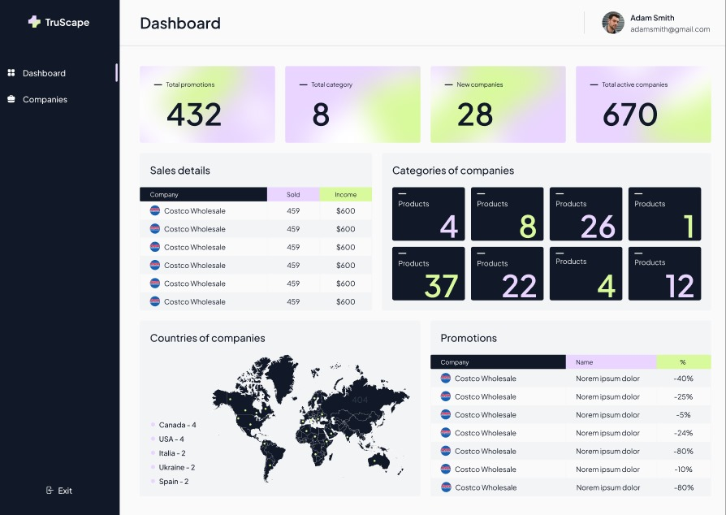

# CRM Project

  The CRM project was developed while studying the Next.js course.

    
    
    

  A Customer Relationship Management (CRM) system built with Next.js to streamline customer interactions and enhance business processes.

## Usage

To add a new customer, click on the "Add Customer" button.
Use the search functionality to filter customer data.
Screenshots

## Project Structure

- `/dashboard` - Contains pages and components related to the Dashboard. This includes the main interface elements such as charts, tables, and logic for displaying key metrics and CRM data.
- `/components` - Reusable React components. These are generic components used across different parts of the application, like buttons, forms, modals, etc.
- `/api` - API routes. These endpoints handle server requests, interact with the database, and connect with other services.

##Technologies

    Next.js
    React
    Tailwind CSS

## Dependencies

## DevDependencies

##  Layout and Design
The application's layout and design are implemented based on the  [Figma design](https://www.figma.com/design/dPmdjAc0qKNMCKwWiC33QZ/CRM?node-id=78-6586&t=P8aSgQ7ckIgyLoeN-0), ensuring a modern and user-friendly interface.
